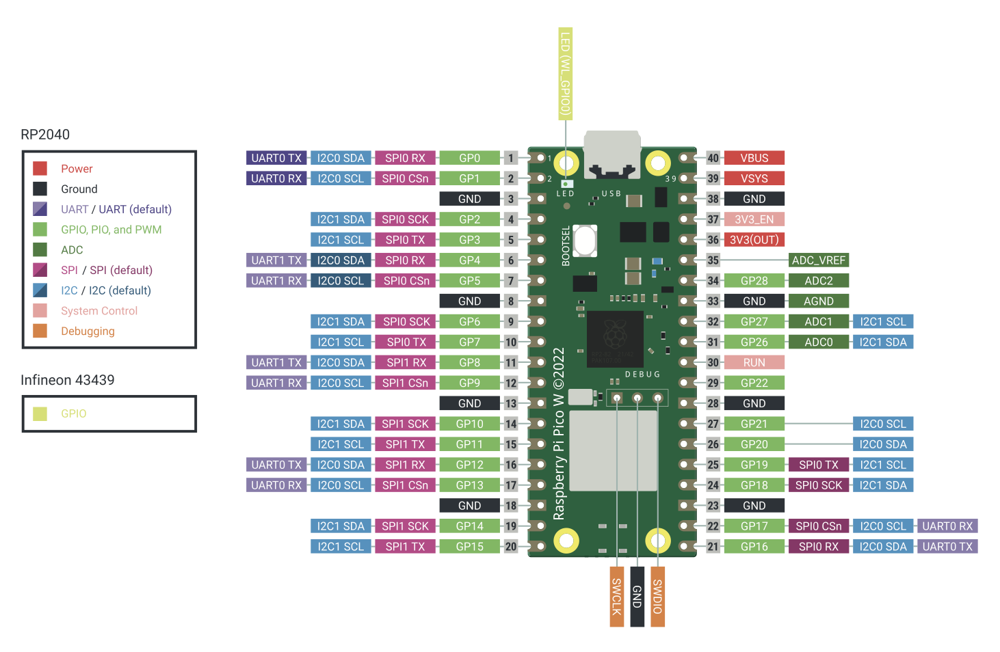

## Welcome to raspberry pico sensors repository
This repository contains a collection of basic sensor measurements with MicroPython code and connection setup. The measurements are done with Raspberry Pico (WH) board. The code is written in MicroPython. The measurements can be saved into a file and can be visualized with the help of Jupyter notebook or some other tool.

## Requirements
1. Raspberry Pico (W) board
2. Sensor
3. MircoPico vscode extension (optional) -> easy setup

### Projects (table)
| Project | Description |
| --- | --- |
| [Flex](/raspberry_pico_sensors/flex/README.md) | This setup uses flex sensor (Flex Sensor 2.2) to measure the flex. |
| [Motion vibration](/raspberry_pico_sensors/motion_vibration/README.md) | This project uses vibration sensor (SW1801P/LM393) to measure the vibration. |
| [Strain gauge](/raspberry_pico_sensors/strain_gauge/README.md) | This setup uses strain gauge sensor (BF350-3AA/1.5AA) to measure the strain. |
| [EKG heartbeat](/raspberry_pico_sensors/ekg_heartbeat/README.md) | This setup uses heart beat sensor (AD8232) to measure the heart beat rate. |
| [Heartbeat](/raspberry_pico_sensors/heart_beat/README.md) | This setup uses heart beat sensor (XD-58C) to measure the heart beat rate. |
| [Motion](/raspberry_pico_sensors/motion/README.md) | This setup uses HC-SR501 PIR Motion sensor to detect movement. |
| [Force](/raspberry_pico_sensors/force_sensing_resistor/README.md) | This setup uses force sensing resistor (FSR 400) to measure the force. |
| [MPU-9250 (gyro+acceleration)](/raspberry_pico_sensors/mpu_9250/README.md) | MPU-9250 for movement measuring. |
| [Temperature (DS18B20)](/raspberry_pico_sensors/DS18B20_temperature/README.md) | DS18B20 for temperatire measuring. |
| [Rain drops (MH-RD)](/raspberry_pico_sensors/rain_sensor/README.md) | Rain drop detection. |
| [Temp/Humidity (DHT-22/AM2302)](/raspberry_pico_sensors/am_2302/README.md) | temperature and humidity. |
| [Build-in temperature sensor](raspberry_pico_sensors/buildin_temperature/README.md)  | This setup uses build in temperature sensor to measure the temperature. |

### Raspberry Pico (W) pinout
- https://picow.pinout.xyz/

### Raspberry Pico (W) datasheet
- https://datasheets.raspberrypi.com/pico/pico-datasheet.pdf

#### Micopython setup
Follow guide on:
https://micropython.org/download/ (pick the correct file based on pico board)

Or watch followng video (great content in this channel)
https://www.youtube.com/watch?v=ERdmCimt1do
