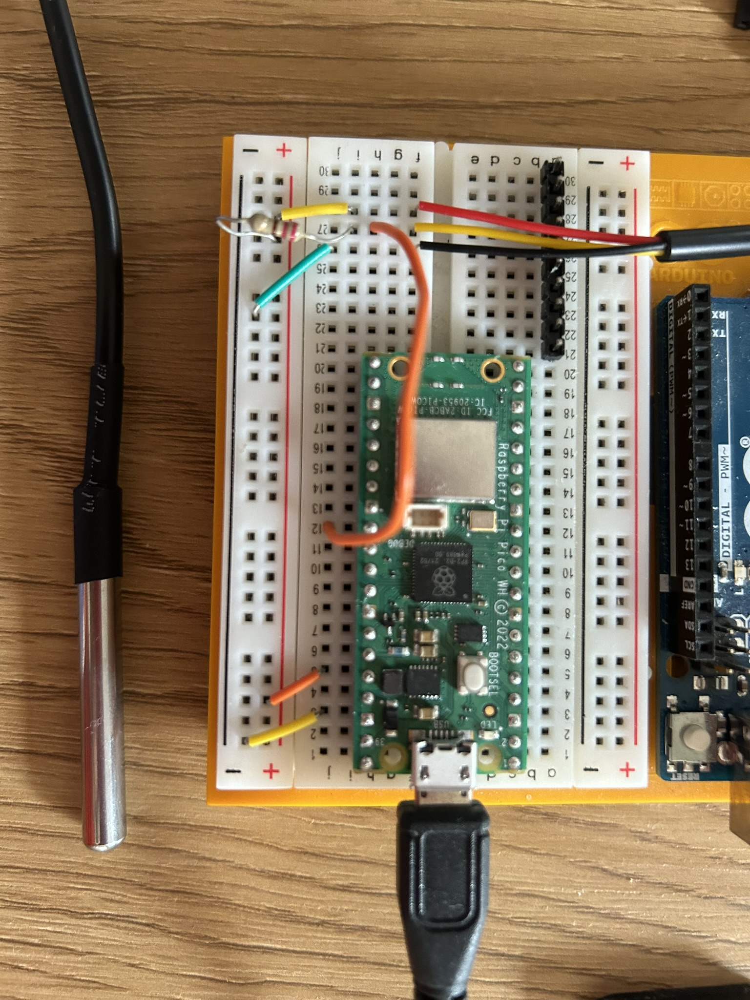

# Welcome to temperature measure repository
This repository contains the code for measuring temperature using DS18B20 sensor. 

## Requirements
1. Raspberry Pi Pico
2. Temperature sensor (DS18B20)

## How to use
1. Connect the sensor to the Raspberry board as shown in the figure below.
2. Upload the code to the Raspberry board.
3. Heat the sensor to see the changes.

## Setup

## More resources:
https://randomnerdtutorials.com/raspberry-pi-pico-ds18b20-micropython/
https://electrocredible.com/raspberry-pi-pico-ds18b20-temperature-sensor/
