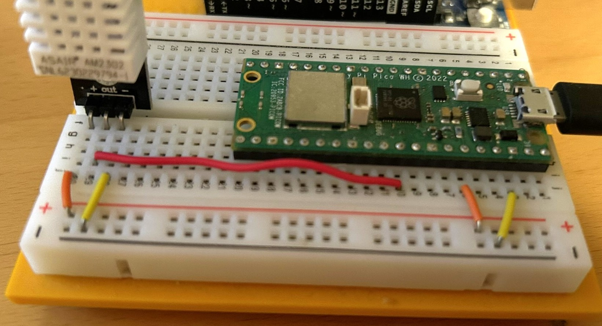

# Welcome to tewmperature and humidity measurement
This is a simple code to measure temperature and humidity using DHT22/AM2302.

## Requirements
1. Raspberry Pi Pico
2. DHT sensor (AM2302)

## How to use
1. Connect the sensor to the Raspberry board as shown in the figure below.
2. Upload the code to the Raspberry board.
3. The code will run automatically and the sensor data will be displayed in terminal.

## Setup

## More resources:
https://docs.micropython.org/en/latest/esp8266/tutorial/dht.html
https://www.electroschematics.com/arduino-dht22-am2302-tutorial-library/

