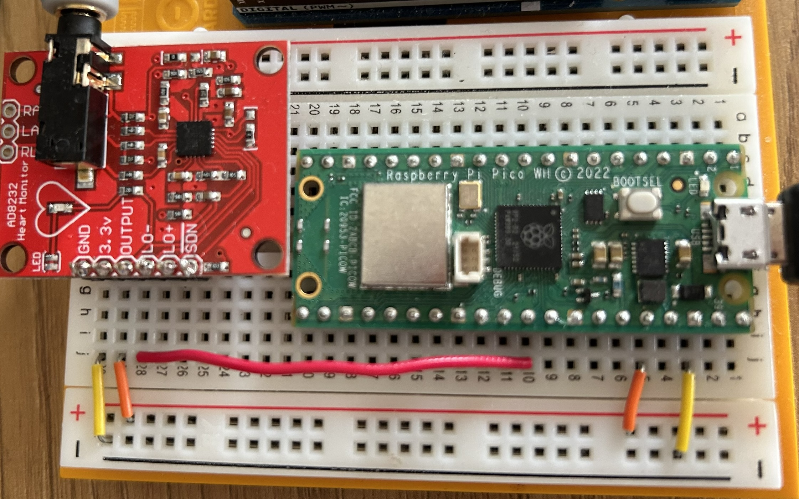

# Welcome to ekg_heartbeat sensor measurement
This repository contains the code for the ekg_heartbeat project. This project uses heart beat sensor to measure the heart beat rate and save it into "ekg_data.txt" file. Some measurements can be found in the "exploration/ekg_data.txt" file.

## Requirements
1. Arduino Pico
2. EKG sensor (AD8232)

## How to use
1. Connect the sensor to the Arduino board as shown in the figure below.
2. Upload the code to the Arduino board.
3. TBD: schema how to attach sensors to your body.

## Setup

## More resources:
- https://how2electronics.com/iot-ecg-monitoring-ad8232-sensor-esp32/
- https://circuitdigest.com/microcontroller-projects/understanding-ecg-sensor-and-program-ad8232-ecg-sensor-with-arduino-to-diagnose-various-medical-conditions

## Data exploration and analysis resources:
- https://www.kaggle.com/code/stetelepta/exploring-heart-rate-variability-using-python
- https://python-heart-rate-analysis-toolkit.readthedocs.io
