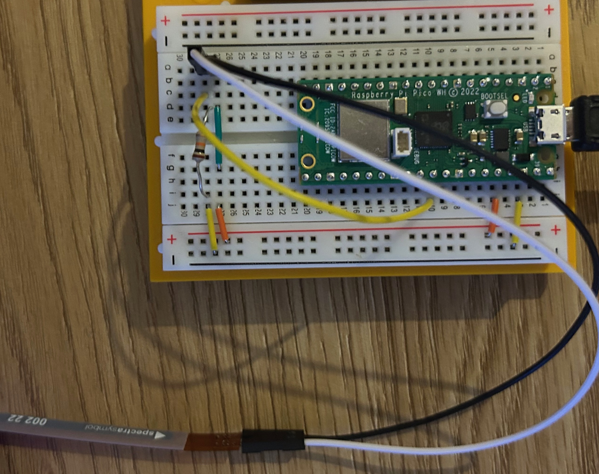

# Welcome to flex sensor measurement
This repository contains the code for the flex sensor project. This project uses flex sensor to measure the flex.

## Requirements
1. Arduino Pico
2. Flex sensor (Flex Sensor 2.2)

## How to use
1. Connect the sensor to the Arduino board as shown in the figure below.
2. Upload the code to the Arduino board.
3. Bend the sensor to measure the flex.

## Setup

## More resources:
https://www.google.com/url?sa=i&url=https%3A%2F%2Fwww.quora.com%2FHow-can-I-interface-a-flex-sensor-with-Raspberry-Pi-and-what-resources-do-I-need-to-complete-the-circuit&psig=AOvVaw1tyugNotWXZAdLY62_YLaN&ust=1693421020630000&source=images&cd=vfe&opi=89978449&ved=2ahUKEwik17GEw4KBAxVRiv0HHVhBABIQr4kDegUIARCGAQ

## Specifications:
https://www2.mouser.com/new/spectra-symbol/spectra-symbol-flex-sensors/?_gl=1*16p9zxx*_ga*MTcyNjUxMDE0Mi4xNjkzMzM0ODMw*_ga_15W4STQT4T*MTY5MzMzNDgyOS4xLjEuMTY5MzMzNDg4My4wLjAuMA..*_ga_1KQLCYKRX3*MTY5MzMzNDgyOS4xLjEuMTY5MzMzNDg4My42LjAuMA

