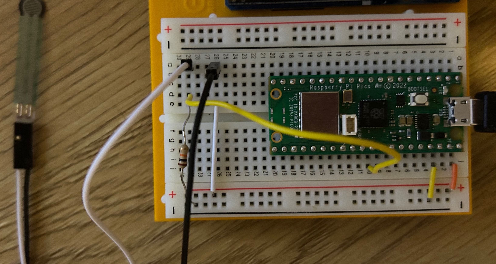

# Welcome to force_sensing repository
This repository contains the code for the force sensing resistor project. This project uses force sensing resistor to measure the force.

## Requirements
1. Raspberry Pi Pico
2. Force sensing resistor (FSR 400)

## How to use
1. Connect the sensor to the Raspberry board as shown in the figure below.
2. Upload the code to the Raspberry board.
3. Press the sensor to measure the force.

## Setup

## More resources:
https://www.pololu.com/product/1695
https://lastminuteengineers.com/fsr-arduino-tutorial/  