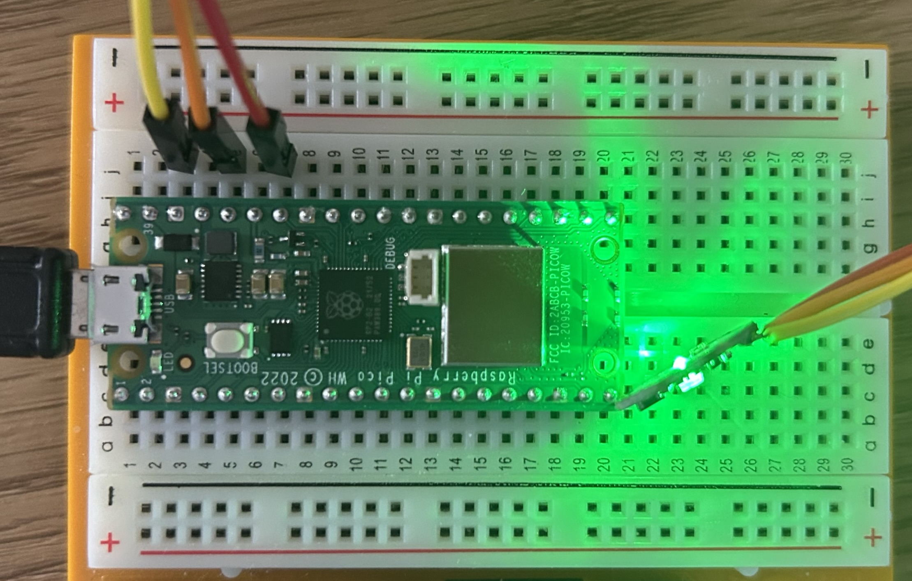

# Welcome to heart_beat repository
This repository contains the code for the heart_beat project. This project uses heart beat sensor to measure the heart beat rate and save it into "Pressed.txt" file.

## Requirements
1. Raspberry Pi Pico
2. Heart beat sensor (XD-58C)

## How to use
1. Connect the sensor to the Raspberry board as shown in the figure below.
2. Upload the code to the Raspberry board.
3. Hold the sensor with your finger.

## Setup

