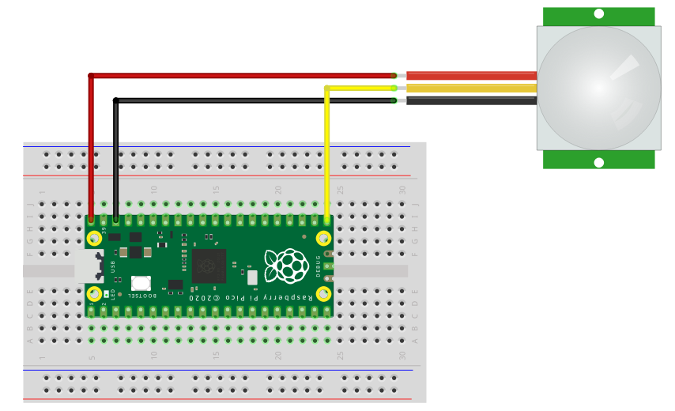

# Welcome to flex sensor measurement
This repository contains the code for the PIR motoin sensor (HC-SR501)

## Requirements
1. Raspberry Pi Pico
2. Motion sensor (HC-SR501)

## How to use
1. Connect the sensor to the Raspberry board as shown in the figure below.
2. Upload the code to the Raspberry board.
3. Do some movement.

## Setup

## More resources:
https://www.theelectronics.co.in/2021/06/pir-motion-sensor-raspberry-pi-pico-rp2040.html

