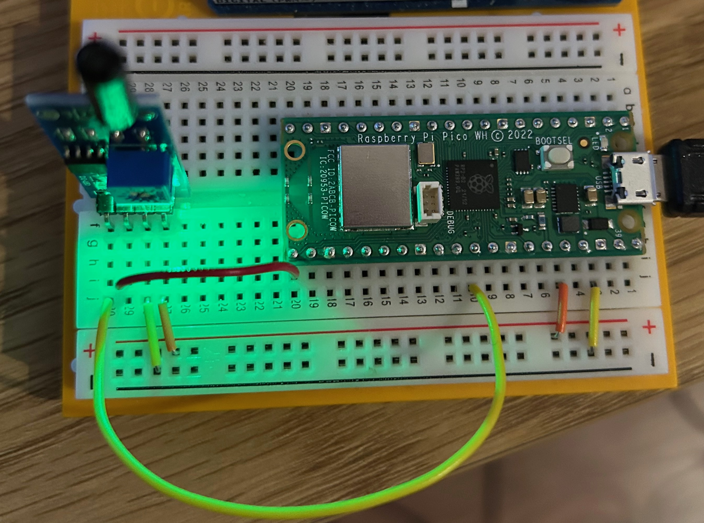

# Welcome to vibration measurement
This repository contains the code for the vibration project. This project uses vibration sensor to measure the vibration.

## Requirements
1. Raspberry Pi Pico
2. Vibration sensor (SW1801P/LM393)

## How to use
1. Connect the sensor to the Raspberry board as shown in the figure below.
2. Upload the code to the Raspberry board.
3. Move the sensor to measure the vibration.

## Setup

## More resources:
https://botland.store/withdrawn-products/10920-vibration-sensor-sw1801p-5904422349271.html
https://chewett.co.uk/blog/721/sw-18010p-motion-vibration-sensor-review-code-examples/

