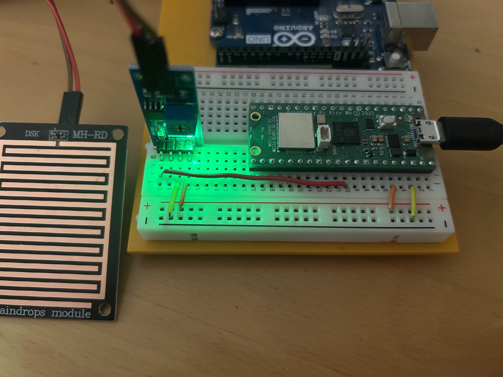

# Welcome to rain drops measurement
This repository contains the code for the MH-RD rain drops sensor.

## Requirements
1. Raspberry Pi Pico
2. Raindrops module (MH-RD)

## How to use
1. Connect the sensor to the Pico board.
2. Upload the code to the Raspberry board.
3. Drop some water on the sensor (pct should channge).

## Setup

## More resources:
https://microcontrollerslab.com/raindrop-sensor-arduino-detector/
https://www.youtube.com/watch?v=V-fhxt85NOc 
